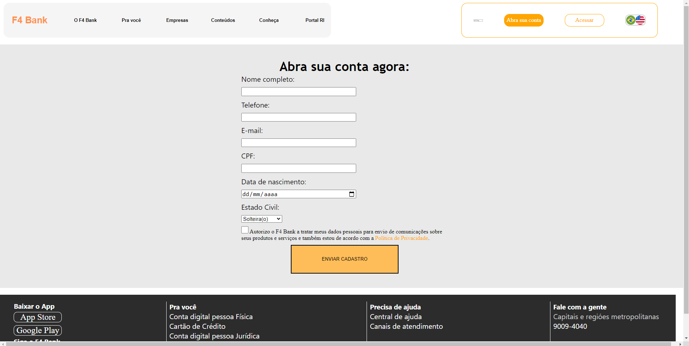
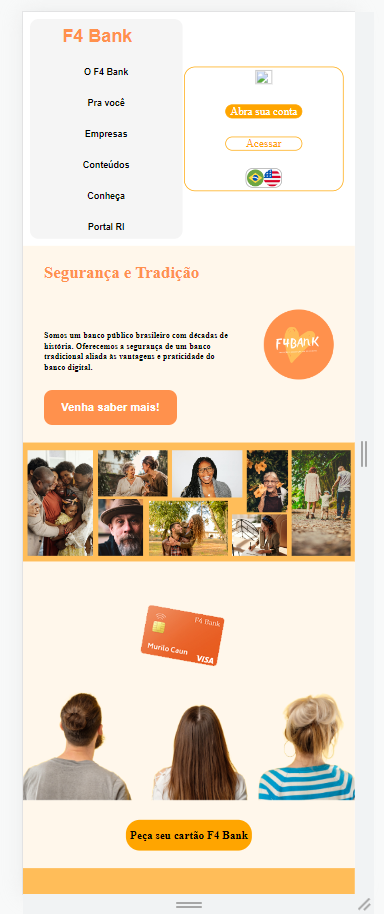

# landing-page-template

Trabalho em grupo reazilado por
-Gabriel Theodoro Ferreira
-Ebele Adaobi Silva
-Murilo Caun Henrique

As paginas foram finalizadas na sexta feira ás 16:30

Contém 3 paginas acessaceis (index.html, cadastro.html, renegocie.html)

Os icones de rede social no footer são funcionais e redirecionam pra suas respectivas páginas

As paginas são responsivas em tablet e celular

link surge: https://used-beginner.surge.sh/

Arquivos de print:

